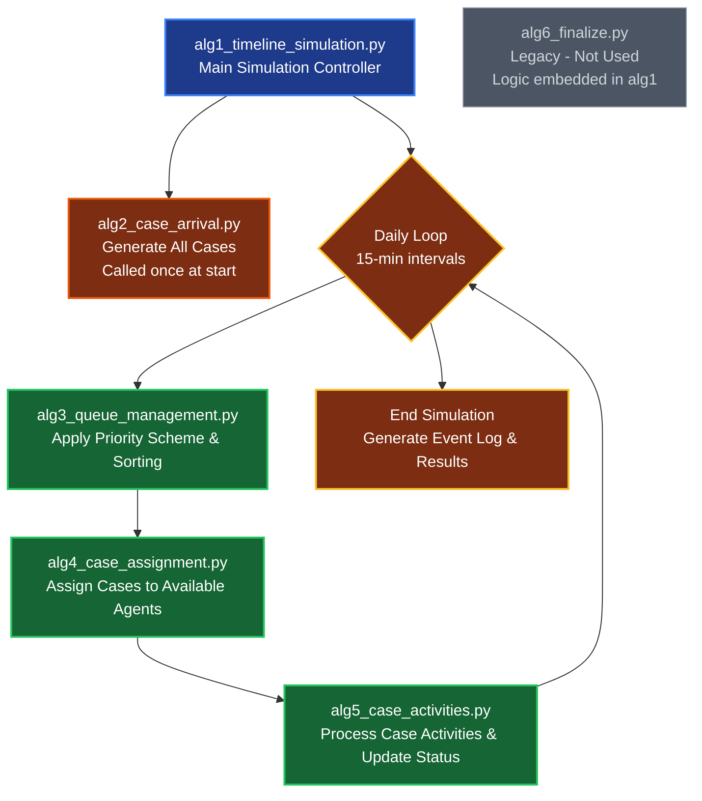
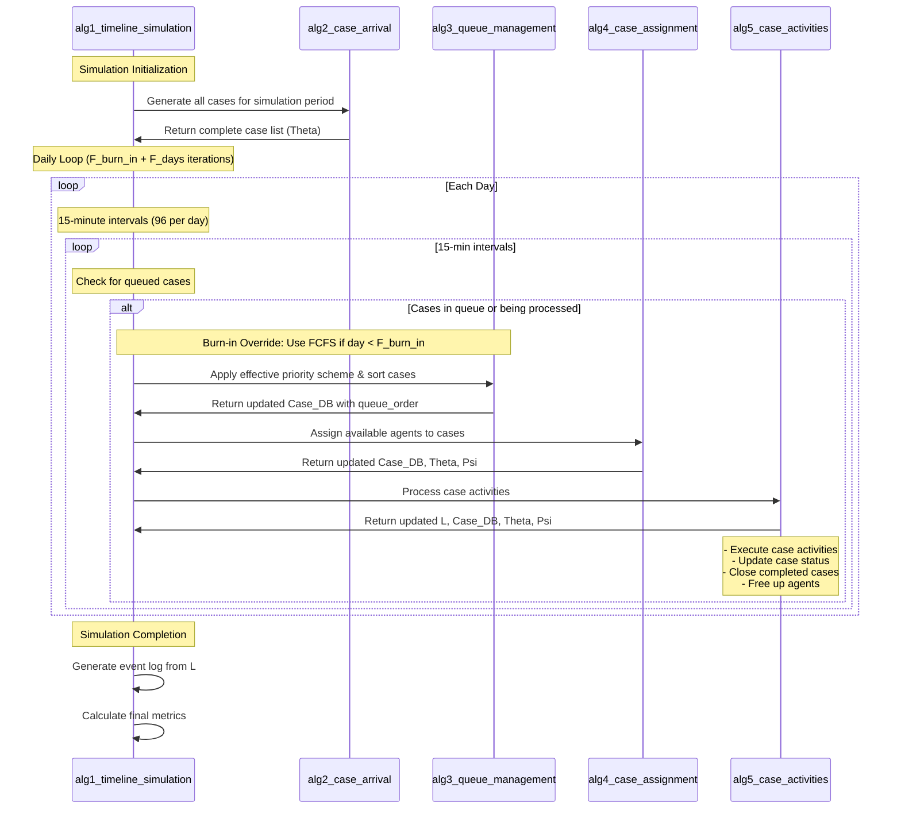

# NPS Simulation Framework

This repository contains a simulation framework for studying Net Promoter Score (NPS) systems with various priority schemes and queue management strategies.

## Overview

The simulation framework allows for:
- Different priority schemes (NPS, SRTF, LRTF, FCFS)
- Variable number of agents
- Hard ceiling implementations
- Burn-in periods
- Multiple simulation runs for statistical significance

## Directory Structure

```
NPS_SIM/
├── algorithms/          # Core simulation algorithms
├── distributions/       # Probability distributions and models
├── helpers/            # Helper functions and batch processing
├── models/             # Mathematical models
├── generate_experiments.py  # Experiment design generation
└── run_experiments.py       # Main experiment runner
```

## Core Components

### Main Scripts

1. **generate_experiments.py**
   - Generates a full factorial design of experiments
   - Configures simulation parameters:
     - Priority schemes (NPS, SRTF, LRTF, FCFS)
     - Number of agents (3-9)
     - Hard ceiling settings
     - Burn-in periods
     - Simulation duration
     - NPS bias
     - Start dates
     - Repetitions
   - Outputs a design table for experiments

2. **run_experiments.py**
   - Executes the simulation experiments
   - Can run in batch mode
   - Manages experiment state and results
   - Handles logging and timing
   - Stores results in CSV format

### Algorithms

The simulation process is broken down into several algorithms:

1. **alg1_timeline_simulation.py**
   - Main simulation controller
   - Orchestrates the entire simulation process

2. **alg2_case_arrival.py**
   - Handles case arrival processes
   - Manages case generation and timing

3. **alg3_queue_management.py**
   - Implements queue management strategies
   - Handles case prioritization
   - **Burn-in FCFS Logic:** Automatically applies FCFS during burn-in period regardless of specified priority scheme

4. **alg4_case_assignment.py**
   - Manages case assignment to agents
   - Implements assignment rules

5. **alg5_case_activities.py**
   - Simulates case activities and processing
   - Tracks case progress

6. **alg6_finalize.py**
   - Handles simulation completion
   - Finalizes results and cleanup

These algorithms work together in a coordinated flow:



#### Algorithm Flow Description

**How to Read This Diagram:**
- **Vertical lines** represent the different algorithm components
- **Arrows** show function calls and data flow between components (left to right)
- **Time flows from top to bottom** - earlier events are higher up
- **Loops** show repeated operations (daily loop contains 15-minute interval loop)
- **Notes** provide additional context about what happens at each stage
- **Alt boxes** indicate conditional operations (only when cases need processing)




### Models

1. **NPS.py**
   - Implements NPS calculation and modeling

2. **throughput.py**
   - Handles throughput time calculations and modeling
   - Contains static pre-trained model with fixed coefficients

3. **dynamic_throughput.py** *(New)*
   - **Dynamic Throughput Time Prediction Model**
   - Trains exponential regression models on burn-in data
   - Provides both training and inference capabilities
   - **Improvements over static model:**
     - Adapts to actual system performance during burn-in
     - Fixes topic encoding bugs present in static model (e.g., d_2 topic correctly mapped)
     - Provides comprehensive error handling and fallback mechanisms
   - Key functions:
     - `train_model_on_burn_in()`: Trains model on observed burn-in cases
     - `predict_TT_dynamic()`: Makes predictions using trained model
     - `save_model()`/`load_model()`: Model persistence in JSON format
   - **Benefits:**
     - More accurate predictions adapted to actual system performance
     - Improved realism of throughput time estimates for main simulation
     - Enhanced validity of NPS-based prioritization decisions

### Key Simulation Parameters

The simulation accepts several key parameters that control its behavior:

#### **Priority Scheme Behavior During Simulation**

**Important:** All experiments automatically use **FCFS prioritization during the burn-in period** regardless of the specified priority scheme. This ensures that:
- Dynamic models are trained on consistent FCFS baseline data
- All methods start from the same operational foundation  
- Post burn-in performance differences represent genuine prioritization effects

**Simulation Timeline:**
```
Total Days = F_burn_in + F_days

Days 0 → F_burn_in-1:           FCFS prioritization (automatic override)
Day F_burn_in:                  Dynamic model training (if enabled) using FCFS data
Days F_burn_in → (F_burn_in + F_days - 1):  Specified priority scheme (NPS, SRTF, LRTF, etc.)
```

- **`F_fit_on_burn_in`** *(String Parameter)*:
  - **Description:** Controls whether dynamic model training is performed on burn-in data
  - **Values:** `"Train"` (enable dynamic training) or `"Static"` (use static model only)
  - **When "Train":**
    - Model training occurs at the end of the burn-in period (day `F_burn_in`)
    - Exponential regression is fitted on observed throughput times from closed burn-in cases
    - Trained model parameters are saved as `dynamic_throughput_model.json` in the run directory
    - All cases arriving after burn-in use dynamically trained predictions
    - Falls back to static model if training fails or insufficient data
    - **Performance metrics calculated:**
      - `dynamic_model_mae_burnin`: Mean Absolute Error on burn-in training data
      - `dynamic_model_mse_burnin`: Mean Squared Error on burn-in training data  
      - `dynamic_model_mae_main`: Mean Absolute Error on main period predictions vs actual
      - `dynamic_model_mse_main`: Mean Squared Error on main period predictions vs actual
      - `dynamic_model_n_burnin_samples`: Number of burn-in cases used for training
      - `dynamic_model_n_main_cases`: Number of main period cases used for evaluation
  - **When "Static":** 
    - Uses static pre-trained model for all throughput time predictions
    - All dynamic model metrics are set to NaN/0
    - Maintains backward compatibility with existing experiments
  - **Significance:** Enables more realistic throughput time predictions and provides metrics to assess prediction quality

- **`F_burn_in`**:
  - **Description:** Number of days for the burn-in/warm-up period (ADDED to F_days)
  - **Purpose:** Allows system to reach steady state before measurement begins
  - **Total Simulation Time:** `F_burn_in + F_days` days
  - **Prioritization Behavior:** 
    - **Days 0 to F_burn_in-1:** FCFS prioritization is automatically applied regardless of specified priority scheme
    - **Days F_burn_in to (F_burn_in + F_days - 1):** Original specified priority scheme (NPS, SRTF, LRTF, etc.) is used
  - **Dynamic Model Training:** When `F_fit_on_burn_in="Train"`, serves as training period using FCFS-prioritized data only
  - **Rationale:** Ensures dynamic models are trained on consistent FCFS baseline data, providing clean comparison for prioritization method effectiveness

- **`F_days`**:
  - **Description:** Number of days for the main simulation period (AFTER burn-in)
  - **Purpose:** Duration of the actual measurement period where specified priority schemes are applied
  - **Total Impact:** Combined with F_burn_in to give total simulation time of `F_burn_in + F_days`

#### **Uniform Duration Mode** *(New Feature)*

- **`F_uniform_duration_mode`** *(String Parameter)*:
  - **Description:** Controls whether uniform duration mode is enabled for case processing
  - **Values:** `"DISABLED"` (default) or `"ENABLED"`
  - **When "DISABLED":**
    - Uses the standard markov chain process for case activities
    - Cases follow realistic activity patterns: Task-Reminder → Interaction → Email → END
    - Activity durations are sampled from Weibull distributions based on case topic, agent personality, and task number
  - **When "ENABLED":**
    - **Bypasses the markov chain completely**
    - Each case has exactly **one activity** followed by END
    - All cases take exactly the same duration (perfect throughput time prediction)
    - Activity type is labeled as `"UniformWork"` in event logs
  - **Purpose:** Enables testing of prioritization methods under perfect throughput time prediction scenarios

- **`F_uniform_duration_minutes`** *(Integer Parameter)*:
  - **Description:** Duration in minutes for each case when uniform duration mode is enabled
  - **Default Value:** 180 minutes (3 hours)
  - **Range:** Any positive integer (e.g., 60, 120, 180, 240)
  - **Impact:** Controls the total case processing time, which affects:
    - Overall system throughput
    - Agent utilization rates
    - Queue dynamics
  - **Note:** Only applies when `F_uniform_duration_mode = "ENABLED"`

**Use Case:** This feature is particularly valuable for studying the theoretical upper bound of NPS-based prioritization by eliminating throughput time prediction errors. It answers the research question: *"What is the maximum benefit achievable by improving throughput time prediction accuracy?"*

- **Other Parameters:** Number of agents, priority schemes, NPS bias factors, etc.

### Distributions

1. **p_vectors.py**
   - Probability vector implementations

2. **tNPS.py**
   - NPS distribution modeling

3. **agents.py**
   - Agent behavior and characteristics

4. **lognorm.py**
   - Log-normal distribution implementations

### Helpers

1. **run_batch_experiments.py**
   - Manages batch processing of experiments
   - Handles parallel execution

2. **helper_functions.py**
   - Utility functions for the simulation

## Dependencies

All required dependencies are listed in `requirements.txt`. Install with:

```bash
pip install -r requirements.txt
```

Key dependencies:
- **numpy**: Scientific computing and array operations
- **pandas**: Data manipulation and analysis (if needed)
- **scipy**: Mathematical optimization for dynamic model training
- **mpmath**: Multi-precision arithmetic for numerical stability

Standard library modules (included with Python):
- datetime, pathlib, json, logging, typing, os, time, multiprocessing

## Usage

1. Generate experiments:
   ```bash
   python generate_experiments.py
   ```

2. Run experiments:
   ```bash
   python run_experiments.py batch <batch_number>
   ```

## Output

The simulation generates:
- **Event logs (`*_log.csv`)** with columns including:
  - `F_priority_scheme`: The originally specified priority scheme
  - `effective_priority_scheme`: The actually applied priority scheme (FCFS during burn-in, specified scheme after)
  - `F_days`: Main simulation period duration (AFTER burn-in)
  - `F_total_days`: Total simulation duration (F_burn_in + F_days)
  - `F_burn_in`: Burn-in period duration
  - `F_uniform_duration_mode`: Whether uniform duration mode was enabled ("ENABLED"/"DISABLED")
  - `F_uniform_duration_minutes`: Duration in minutes for uniform mode cases (if enabled)
  - `activity`: Activity type (standard types or "UniformWork" in uniform mode)
  - Standard event and timing information
- **Case databases (`*_case_DB.csv`)**
- **Burn-in data** (when `F_burn_in > 0`):
  - `*_burnin_log.csv`: Event log for burn-in period cases (all using FCFS prioritization)
  - `*_burnin_case_DB.csv`: Case database for burn-in period cases
- **Dynamic model files** (when `F_fit_on_burn_in="Train"`):
  - `dynamic_throughput_model.json`: Trained model parameters and metadata (trained on FCFS data only)
- **Timeseries snapshots (`*_timeseries.csv`)**
- **Experiment results with timing information**
- **Performance metrics** including:
  - Simulated NPS scores
  - Throughput times
  - Queue lengths
  - Agent utilization
  - **Dynamic model performance metrics** (when `F_fit_on_burn_in="Train"`):
    - MAE and MSE on burn-in training data (from FCFS-prioritized cases)
    - MAE and MSE on main period prediction accuracy
    - Sample sizes for training and evaluation

## Important Implementation Notes

### **Burn-in FCFS Override & Extended Simulation Time**
- **All experiments automatically use FCFS during burn-in period** regardless of specified priority scheme
- **Total simulation time = F_burn_in + F_days** (burn-in days are ADDED to main days)
- This ensures dynamic models are trained on consistent, unbiased baseline data
- The `effective_priority_scheme` column in event logs tracks which scheme was actually applied
- Post burn-in results represent true prioritization method performance over the full F_days duration

### **General Notes**
- The simulation uses fixed random seeds for reproducibility
- Results are stored in the `results/` directory
- Each experiment run creates its own subdirectory
- Batch processing is supported for large-scale experiments 