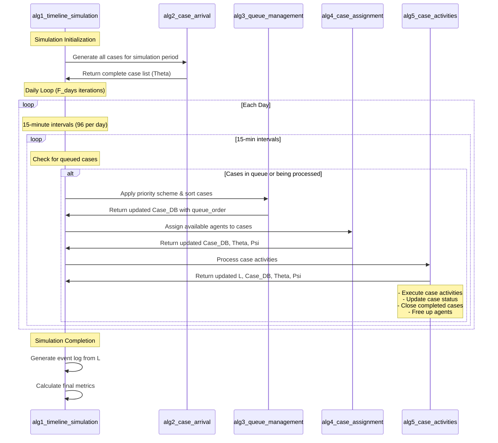

# NPS Simulation Framework

This repository contains a simulation framework for studying Net Promoter Score (NPS) systems with various priority schemes and queue management strategies.

## Overview

The simulation framework allows for:
- Different priority schemes (NPS, SRTF, LRTF, FCFS)
- Variable number of agents
- Hard ceiling implementations
- Burn-in periods
- Multiple simulation runs for statistical significance

## Directory Structure

```
NPS_SIM/
├── algorithms/          # Core simulation algorithms
├── distributions/       # Probability distributions and models
├── helpers/            # Helper functions and batch processing
├── models/             # Mathematical models
├── generate_experiments.py  # Experiment design generation
└── run_experiments.py       # Main experiment runner
```

## Core Components

### Main Scripts

1. **generate_experiments.py**
   - Generates a full factorial design of experiments
   - Configures simulation parameters:
     - Priority schemes (NPS, SRTF, LRTF, FCFS)
     - Number of agents (3-9)
     - Hard ceiling settings
     - Burn-in periods
     - Simulation duration
     - NPS bias
     - Start dates
     - Repetitions
   - Outputs a design table for experiments

2. **run_experiments.py**
   - Executes the simulation experiments
   - Can run in batch mode
   - Manages experiment state and results
   - Handles logging and timing
   - Stores results in CSV format

### Algorithms

The simulation process is broken down into several algorithms:

1. **alg1_timeline_simulation.py**
   - Main simulation controller
   - Orchestrates the entire simulation process

2. **alg2_case_arrival.py**
   - Handles case arrival processes
   - Manages case generation and timing

3. **alg3_queue_management.py**
   - Implements queue management strategies
   - Handles case prioritization

4. **alg4_case_assignment.py**
   - Manages case assignment to agents
   - Implements assignment rules

5. **alg5_case_activities.py**
   - Simulates case activities and processing
   - Tracks case progress

6. **alg6_finalize.py**
   - Handles simulation completion
   - Finalizes results and cleanup

These algorithms work together in a coordinated flow:


#### Algorithm Flow Description

**How to Read This Diagram:**
- **Vertical lines** represent the different algorithm components
- **Arrows** show function calls and data flow between components (left to right)
- **Time flows from top to bottom** - earlier events are higher up
- **Loops** show repeated operations (daily loop contains 15-minute interval loop)
- **Notes** provide additional context about what happens at each stage
- **Alt boxes** indicate conditional operations (only when cases need processing)




### Models

1. **NPS.py**
   - Implements NPS calculation and modeling

2. **throughput.py**
   - Handles throughput time calculations and modeling

### Distributions

1. **p_vectors.py**
   - Probability vector implementations

2. **tNPS.py**
   - NPS distribution modeling

3. **agents.py**
   - Agent behavior and characteristics

4. **lognorm.py**
   - Log-normal distribution implementations

### Helpers

1. **run_batch_experiments.py**
   - Manages batch processing of experiments
   - Handles parallel execution

2. **helper_functions.py**
   - Utility functions for the simulation

## Dependencies

- Python 3.x
- pandas
- numpy
- mpmath
- datetime

## Usage

1. Generate experiments:
   ```bash
   python generate_experiments.py
   ```

2. Run experiments:
   ```bash
   python run_experiments.py batch <batch_number>
   ```

## Output

The simulation generates:
- Event logs (`*_log.csv`)
- Case databases (`*_case_DB.csv`)
- Experiment results with timing information
- Performance metrics including:
  - Simulated NPS scores
  - Throughput times
  - Queue lengths
  - Agent utilization

## Notes

- The simulation uses fixed random seeds for reproducibility
- Results are stored in the `results/` directory
- Each experiment run creates its own subdirectory
- Batch processing is supported for large-scale experiments 